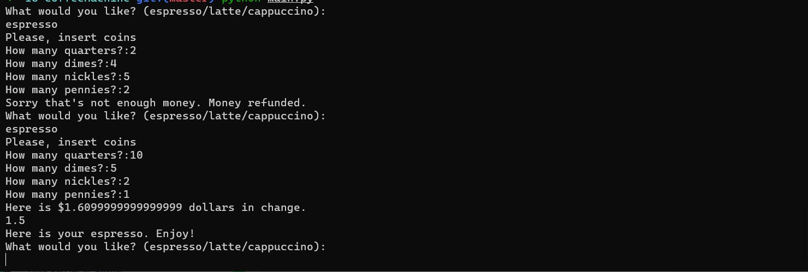

Features
Usage and examples How It Works


<p align="center">
  
</p>


## Contents
- [Features](#features)
- - [Get started](#features)
- [Building](#building)
- [Using Edlib in your project](#using-edlib-in-your-project)
- [Usage and examples](#usage-and-examples)
- [API documentation](#api-documentation)
- [Alignment methods](#alignment-methods)
- [Aligner](#aligner)
- [Running tests](#running-tests)
- [Time and space complexity](#time-and-space-complexity)
- [Test data](#test-data)
- [Development and contributing](#development-and-contributing)
- [Publication](#publication)
- [Acknowledgements](#acknowledgements)


## Using Edlib in your project
You can use Edlib in you project by either directly copying header and source files from [edlib/](edlib/), or by linking Edlib library (see [Building](#building) for instructions how to build Edlib libraries).
In any case, only thing that you have to do in your source files is to include `edlib.h`.


## How It Works

1. Size Limit contains a CLI tool, 3 plugins (`file`, `webpack`, `time`)
   and 3 plugin presets for popular use cases (`app`, `big-lib`, `small-lib`).
   A CLI tool finds plugins in `package.json` and loads the config.
2. If you use the `webpack` plugin, Size Limit will bundle your JS files into
   a single file. It is importa
   
   
   
   
## Built with

<h2>Usage Examples</h2>
Start server on dump file:
<pre>
java -jar df.jar --dump dump.txt
</pre>
Start server with built-in OpenAPI client:
<pre>java -jar df.jar --openapi-path /api --dump dump.txt
</pre>

<details>
<summary>
  more examples&hellip;
</summary>
<br>
Start server on few dump files:
<pre>
java -jar df.jar --dump dump1.txt dump2.txt dump3.txt
</pre>
Start server with built-in OpenAPI client with custom title:
<pre>
java -jar df.jar --openapi-path /api --openapi-title 'My REST API v18.2.1' --dump dump.txt
</pre>
</details>
<details>
<summary>
	even more examples&hellip;
</summary>
<br>
Collect live request/response to file:
<pre>
java -jar df.jar --collect /home/john/live.txt --dump dump.txt
</pre>
Specify JSON data file to populate templates:
<pre>
java -jar df.jar --data /home/john/data.json --dump dump.txt
</pre>
  
 ```sh
git clone https://github.com/thelounge/thelounge.git
cd thelounge
yarn install
NODE_ENV=production yarn build
yarn start
```
</details>
  <h2>Features</h2>
  &nbsp;&nbsp;&nbsp;&nbsp;&check;&nbsp;&nbsp;no dependencies<br>
  &nbsp;&nbsp;&nbsp;&nbsp;&check;&nbsp;&nbsp;no installation<br>
  &nbsp;&nbsp;&nbsp;&nbsp;&check;&nbsp;&nbsp;no configs<br>
  &nbsp;&nbsp;&nbsp;&nbsp;&check;&nbsp;&nbsp;crossplatform<br>
  &nbsp;&nbsp;&nbsp;&nbsp;&check;&nbsp;&nbsp;single-file executable<br>
  &nbsp;&nbsp;&nbsp;&nbsp;&check;&nbsp;&nbsp;command-line interface<br>
  <details>
  <summary>
   more features&hellip;
  </summary>
  <br>
  &nbsp;&nbsp;&nbsp;&nbsp;&check;&nbsp;&nbsp;fully asynchronous<br>
  &nbsp;&nbsp;&nbsp;&nbsp;&check;&nbsp;&nbsp;HTTP message formats RFC 7230<br>
  &nbsp;&nbsp;&nbsp;&nbsp;&check;&nbsp;&nbsp;multiple entries per dump<br>
  &nbsp;&nbsp;&nbsp;&nbsp;&check;&nbsp;&nbsp;multiple request/response entries per dump<br> 

